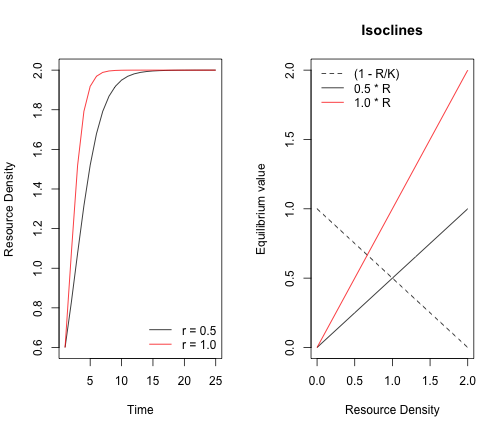

Chapter 3 and 4
========================================================

Chapter 3 introduces and defines the terminology McCann uses for studying subsets of entire food webs.  In the network literature, these subsets are called motifs, and represent the connections between 3 or 4 nodes (e.g. apparent and exploitative compeition, or omnivory in real food webs).  Since McCann focuses on the importance of interaction strength, he refers to these subsets as modules or "motifs with muscles" (as communicted by Robert Holt).  For McCann, modules range from single species to n-species, but they incorporate interaction strength.  Note that modules in the network literature mean something very different than the way McCann defines them.  In networks, modules are subsets of nodes that interact with each other more frequently than other subsets of nodes.  These modules may have a few or many nodes and usually don't account for variation in interaction strength (although there are methods to account for this).  There is actually a considerable amount of reseach to come up with methods for detecting these modules and its not as straight forward as it sounds.

Before getting into more complex models, McCann illustrates the population dynamics of a single species using the continuous logistic growth model.  This phenomological model tends to describe the dynamics of isolated populations quite well (i.e. in the lab). He demonstrates that increases in intrinsic growth rate (r) stabilize population dynamics under this model.  This is because a population with a high intrinsic growth rate that is perturbed will return faster to equilibrium than one with a lower growth rate.


```r
# get everything setup
setwd("~/Dropbox/FoodWebs")
source("Models.R")
library(deSolve)

# set parameter and state variables for continuous logistic growth model
R <- 0.6
r1 <- 0.5
r2 <- 1
K <- 2
p.clg <- c(r = r1, K = K)

# run experiment 1
Time <- 25
clg.1 <- ode(R, 1:Time, clg, p.clg)

# run experiment 2
p.clg2 <- c(r = r2, K = K)  # double the intrinsic growth rate
clg.2 <- ode(R, 1:Time, clg, p.clg2)

# evaluate resource isoclines
Rx <- seq(0, 2, 0.1)
Riso1 <- expression(1 - Rx/K)
Riso2 <- expression(r1 * Rx)  # this one will change when growth rate is altered
Riso3 <- expression(r2 * Rx)
RisoStable <- eval(Riso1)
RisoStable2 <- eval(Riso2)
RisoStable3 <- eval(Riso3)
```


**Effects of increasing intrinsic growth rate on resource density**

```r
par(mfrow = c(1, 2))
plot(clg.1[, 1], clg.1[, 2], type = "l", ylab = "Resource Density", xlab = "Time", 
    )
lines(clg.2[, 1], clg.2[, 2], col = 2)
legend("bottomright", c("r = 0.5", "r = 1.0"), lty = c(1, 1), col = 1:2, bty = "n")

plot(Rx, RisoStable, type = "l", xlab = "Resource Density", ylab = "Equilibrium value", 
    ylim = c(0, 2), main = "Isoclines", lty = 2)
lines(Rx, RisoStable2, lty = 1, col = 1)
lines(Rx, RisoStable3, lty = 1, col = 2)
legend("topleft", c("(1 - R/K)", "0.5 * R", "1.0 * R"), lty = c(2, 1, 1), col = c(1, 
    1, 2), bty = "n")
```

 

In regard to the isocline, I think the interpretation is that with higher intrinsic growth, the population will reach equilibrium faster if it is perturbed to lower resource densities.

A general theme for this book is that **population dynamic models that produce monotonic trajectories tend to increase in stability with increased production.**  McCann refers to these as *nonexcitable population dynamics.*

However, in nature, many populations tend to oscillate or exhibit *excitable population dynamics*.  So the above model doesn't usually apply to complex biological systems.  For example, in many populations, their denesity at a certain point has consequences on their density at some distant time in the future.  In other words, the population response is lagged, rather than instanteous in the previous model.  Now McCann considers the Ricker model, which incorporates discrete population dynamics.  He first examines how increasing growth rate (B in the Ricker Model) influences the population dynamics of the single species.


```r
# setup experiments
Time <- 25
B1 <- 0.5
B2 <- 1.5
B3 <- 2
K <- 2

# run experiments
N1 = matrix(0.1, 1, Time + 1)
for (t in 1:Time) N1[t + 1] = N1[t] * exp(B1 * (1 - N1[t]/K))

N2 = matrix(0.1, 1, Time + 1)
for (t in 1:Time) N2[t + 1] = N2[t] * exp(B2 * (1 - N2[t]/K))

N3 = matrix(0.1, 1, Time + 1)
for (t in 1:Time) N3[t + 1] = N3[t] * exp(B3 * (1 - N3[t]/K))

# get data for phase-space graphs
Nt <- seq(0, 3, 0.1)
Nt1 <- Nt * exp(B1 * (1 - Nt/K))
Nt2 <- Nt * exp(B2 * (1 - Nt/K))
Nt3 <- Nt * exp(B3 * (1 - Nt/K))
NtData <- data.frame(Nt, Nt1, Nt2, Nt3)
```


In contrast to the continuous logistic growth model, the Ricker model is *destabilized* by increasing intrinsic growth rates.

```r
par(mfrow = c(1, 2))
plot(1:Time, N1[1:Time], type = "l", xlab = "Time", ylab = "Resource Density", 
    ylim = c(0, 3))
lines(1:Time, N2[1:Time], col = 2)
lines(1:Time, N3[1:Time], col = 3)
legend("bottomright", c("r = 0.5", "r = 1.5", "r = 2.0"), lty = c(1, 1, 1), 
    col = 1:3, bty = "n")

plot(Nt, Nt1, type = "l", ylim = c(0, 3))
lines(Nt, Nt2, lty = 1, col = 2)
lines(Nt, Nt3, lty = 1, col = 3)
abline(a = 0, b = 1, lty = 2, col = 1)
points(K, K, pch = 16)
```

 

Note that the absolute value of the slope at equilibrium indicates whether the dynamics are stable ( |slope| < 1 ) or unstable ( |slope| > 1) and not whether it is positive or negative.  This differs from continuous logistic growth model where negative real eigenvalues are stable, but positive values are unstable (eigenvalue = slope for this Ricker model)
