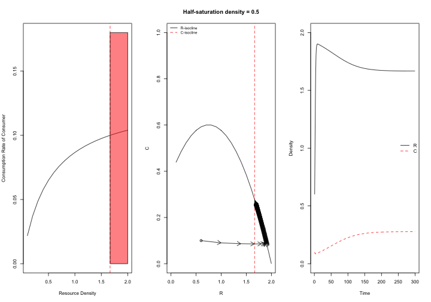
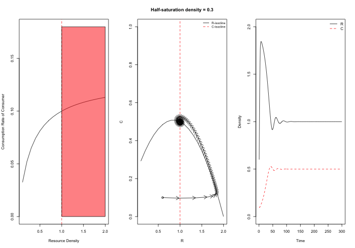

Chapter 5
---------

The code below illustrates how increasing the half-saturation density (Ro) of the Rozenburg-MacArthur consumer-resource model alters the stability of the system.


```
## Error: there is no package called 'seqinr'
```


```r
########### set parameters and state variables for the R-M C-R model state
########### variable values (initial values at beginning of 'experiments')
R <- 0.6
C <- 0.1
i.state <- c(R = 0.6, C = 0.1)

# parameter values
r <- 1  # per capita rate of increase in resource
K <- 2  # indicated as 1.0 in Fig 2.1 description, but I think this was a typo in the book.
e <- 0.5  # predator conversion efficiency
Ro <- 0.5  # half-saturation density of predator functional response
m <- 0.5  # mortality rate of predator
a <- 1.3  # initial attack rate of 1.3 instead of 1.2 more closely replicates the figures in the book
p.rm1 <- c(r = r, e = e, a = a, K = K, Ro = Ro, m = m)  # create a vector for the parameters for experiment #1
```


The figures below are the results of three separate simulations, where the half-saturation density was decreased from 0.5 to 0.2 and all other parameters were held constant.

```
## Error: could not find function "col2alpha"
```

 

```
## Error: could not find function "col2alpha"
```

 

```
## Error: could not find function "col2alpha"
```

 


Below is a bifurcation plot, showing how the dynamics of the system changes along a continuous gradient of half-saturation densities.  Note that at high half-saturation densities, the consumers go extinct, but the stability of the system quickly changes over a short parameter range.
 

